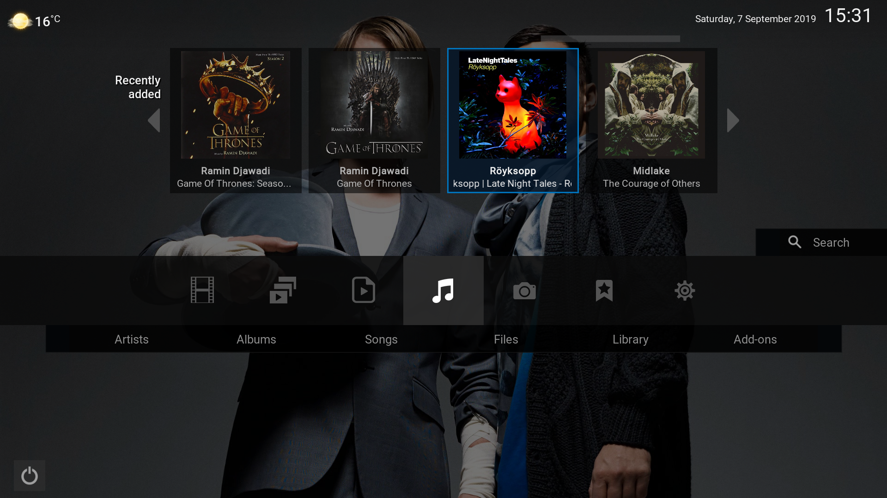
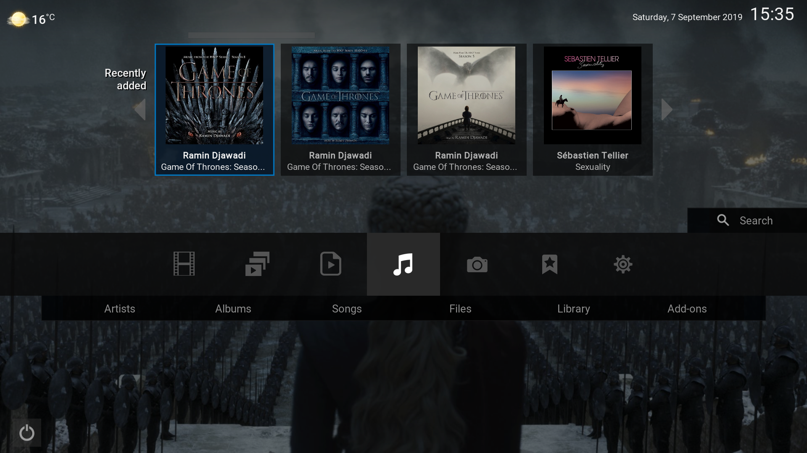
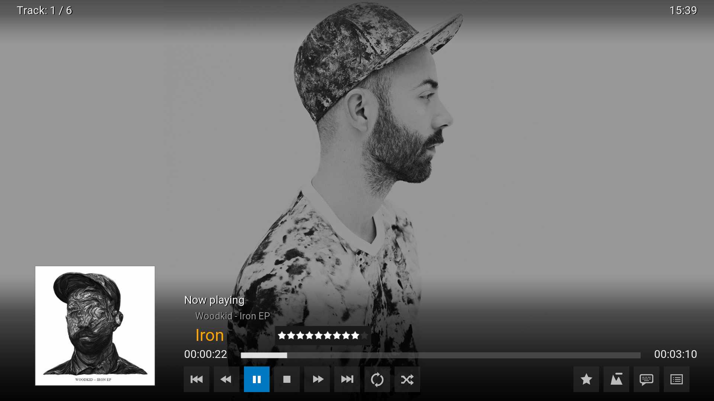
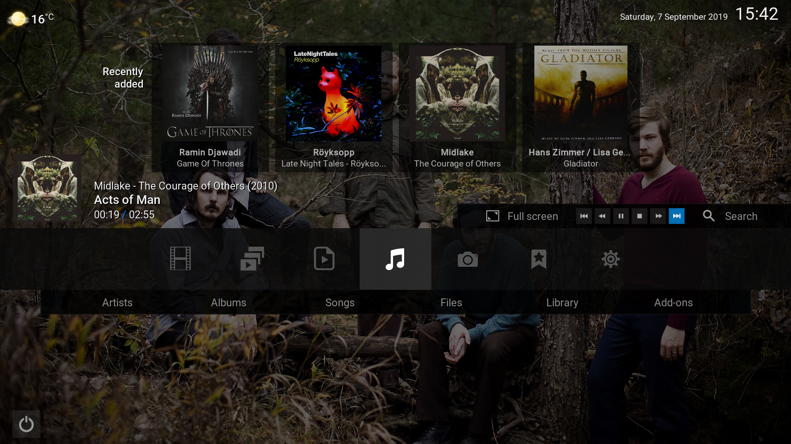

A \[K\]onfluence Zeitgeist
==========================

**IMPORTANT!** "A \[K\]onfluence Zeitgeist" is just a modification of the theme
[A Confluence Zeitgeist](https://forum.kodi.tv/showthread.php?tid=242892&highlight=zeitgeist)
created by axbmcuser. My suggestion is to first try it for a while and then,
check this small mod later.

This are the changes I introduced in the theme:

  1. Removed https://forum.no-intro.org/viewtopic.php?f=7&t=3561Kodi logo from main screen.

  2. Added a "kiosk" mode in settings menu so you can block access to side bar
     menus. This is specially useful for kids, elders, or any non-tech people
     who want or need a simpler interface.

  3. Added album fanart (Confluence Zeitgeist shows just artist fanart).

  4. Music fanart (artist or album) is shown in Home screen or any menu while
     music is playing (Confluence Zeitgeist shows a black screen).

  5. Background fanart is darken in Home screen to make everything more
     readable.

  6. New backgrounds (you know, when I install Kodi in a new machine I don't
     want to be searching around for good looking images).

Screenshots
===========

